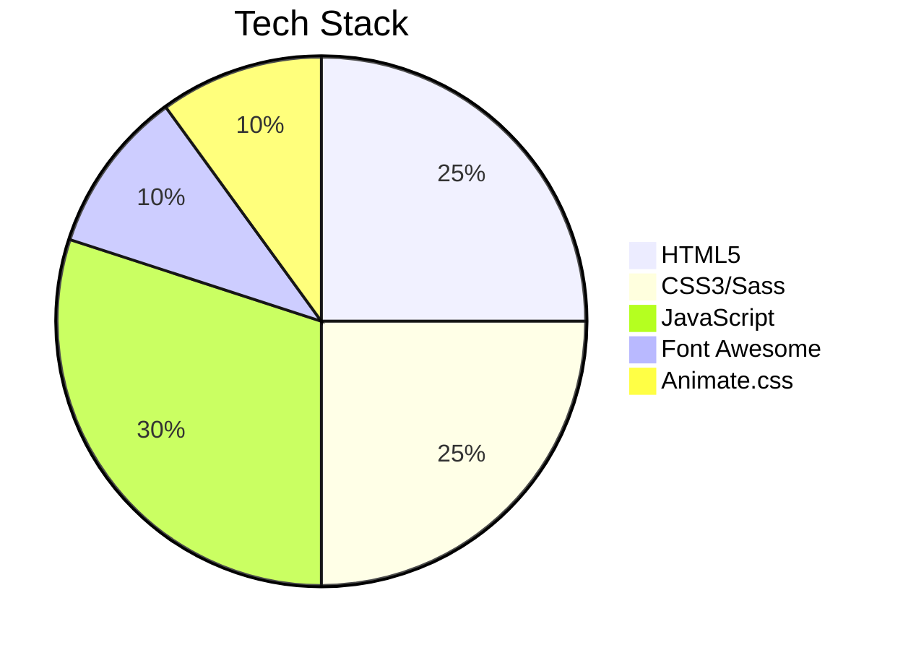

# 🚀 Sukhpreet Saini's Portfolio

Welcome to my **dynamic portfolio project**! This is not just another portfolio - it's an immersive experience showcasing my skills, projects, and achievements with style and interactivity. ✨

[](https://sukh2022.github.io/Profile_project/)
[](https://github.com/SUKH2022/Profile_project/stargazers)

## 🌟 Features

- **Stunning Visual Design** with animated elements and gradient effects
- **Interactive Components** like skill bars, project filters, and certification sliders
- **Responsive Layout** that works flawlessly on all devices 📱💻🖥️
- **Loading Animation** with a cool neural network effect 🧠
- **Animated Typing Effect** in the hero section ✍️
- **Dark/Light Mode Ready** (with elegant dark theme as default) 🌓
- **Google Sheets Integration** for contact form submissions 📝

## 🛠️ Technologies Used


## 🎨 Design Highlights

- Custom animated gradient text for headings
- Glassmorphism effect on cards and sections
- Hover animations on all interactive elements
- Dynamic skill bars that fill based on proficiency level
- Project filtering system by category
- Timeline design for experience section

## 🚀 Getting Started

1. Clone the repo:
```bash
git clone https://github.com/SUKH2022/Profile_project.git
```
2. Open `index.html` in your browser
3. Explore the interactive elements!

## 🔥 Special Features

- **"JARVIS" Desktop Assistant** - AI-powered voice-controlled assistant
- **Unreal Engine 5 Projects** - High-quality 3D game development showcases
- **Power BI Dashboards** - Interactive data visualization samples
- **YouTube Integration** - Embedded project demonstration videos
- **GitHub Stats** - Live coding activity and repository metrics

## 🏆 Achievements Showcase

- 🎓 **Academic Excellence**: 6× Dean's List recipient  
- 💻 **Project Portfolio**: 50+ completed projects across multiple domains  
- 📜 **Professional Development**: 30+ technical certifications  
- 🎪 **Recognition**: Featured exhibitor at college tech exhibitions  
- 🏆 **Leadership**: McDonald's Employee of the Month  

